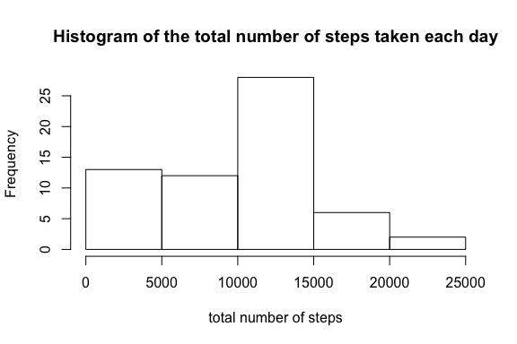
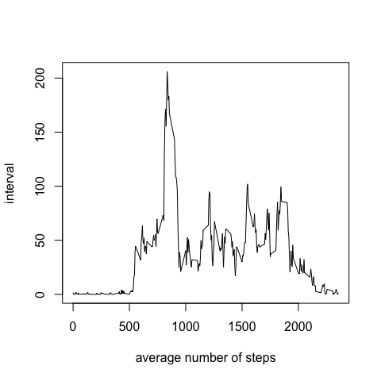
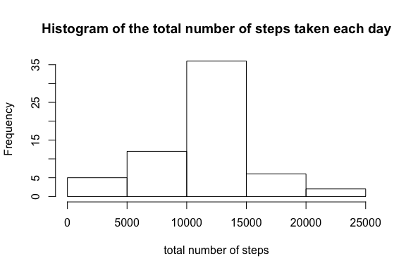
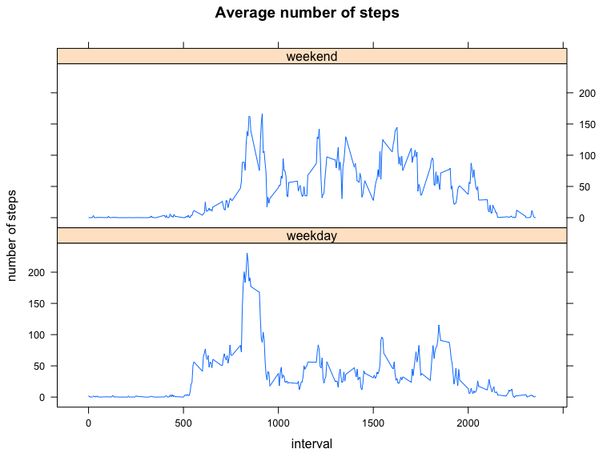

# Reproducible Research: Peer Assessment 1

We first load the libraries this analysis is going to use

```r
library(dplyr)
library(lattice)
```

## Loading and preprocessing the data
Load the data into dataframe

```r
untar('activity.zip')
df <- read.csv('activity.csv')
```

Transfer date column into "Date" class

```r
df$date <- as.Date(df$date)
```

## What is mean total number of steps taken per day?
We first calculate the total number of steps taken per day

```r
df1 <- df %>% group_by(date) %>% summarise(totalSteps = sum(steps, na.rm = TRUE))
df1
```

```
## Source: local data frame [61 x 2]
## 
##          date totalSteps
##        (date)      (int)
## 1  2012-10-01          0
## 2  2012-10-02        126
## 3  2012-10-03      11352
## 4  2012-10-04      12116
## 5  2012-10-05      13294
## 6  2012-10-06      15420
## 7  2012-10-07      11015
## 8  2012-10-08          0
## 9  2012-10-09      12811
## 10 2012-10-10       9900
## ..        ...        ...
```

Plot the histogram of the total number of steps taken each day

```r
hist(df1$totalSteps, xlab = "total number of steps", main = "Histogram of the total number of steps taken each day")
```

 

Calculate the mean and median of the total number of steps taken per day

```r
df1 %>% summarise(mean = mean(totalSteps), median = median(totalSteps))
```

```
## Source: local data frame [1 x 2]
## 
##      mean median
##     (dbl)  (int)
## 1 9354.23  10395
```

As you can see, the mean total number of steps taken per day is 9354.23, and the median is 10395.

## What is the average daily activity pattern?
Calculate the average number of steps taken per 5-minute interval, averaged across all days. Then make a time series plot.

```r
df2 <- df %>% group_by(interval) %>% summarise(avgSteps = mean(steps, na.rm = TRUE))
plot(df2$interval, df2$avgSteps, type = 'l', xlab = "average number of steps", ylab = "interval")
```

 

Find the interval that contains the maximum number of steps on average across all the days

```r
maxSteps = max(df2$avgSteps)
maxSteps
```

```
## [1] 206.1698
```

```r
df2[df2$avgSteps == maxSteps,]$interval
```

```
## [1] 835
```

As you can see, the maximum number of steps on average across all the days is 206 and the corresponding interval is 835.

## Imputing missing values
Count the total number of missing values in the dataset

```r
sum(is.na(df$steps))
```

```
## [1] 2304
```

Create a new dataset which fills NAs with mean of the corresponding 5-minute interval across all days

```r
df3 <- df %>% inner_join(df2)
```

```
## Joining by: "interval"
```

```r
# fill NA values with the mean of the corresponding 5-minute interval across all days
df3$steps <- apply(df3[,c('steps','avgSteps')], 1, function(y) {if (is.na(y['steps'])) y['avgSteps'] else y['steps'] })
df3 <- df3[colnames(df)]
```

Plot a new histogram of the total number of steps taken each day with imputed missing value

```r
df4 <- df3 %>% group_by(date) %>% summarise(totalSteps = sum(steps, na.rm = TRUE))
hist(df4$totalSteps, xlab = "total number of steps", main = "Histogram of the total number of steps taken each day")
```

 

Calculate the new mean and median of the total number of steps taken per day with imputed missing value

```r
df4 %>% summarise(mean = mean(totalSteps), median = median(totalSteps))
```

```
## Source: local data frame [1 x 2]
## 
##       mean   median
##      (dbl)    (dbl)
## 1 10766.19 10766.19
```

After imputing missing values, the new mean and median total number of steps taken per day are both 10766.19. Compared with first part of the assignment, we can see that the number of steps below 10000 are less, and there are more in range 10000 to 15000. The mean value increased about 15% while the median value increased about 3.5%.

## Are there differences in activity patterns between weekdays and weekends?

Create a new factor variable in the dataset with two levels – “weekday” and “weekend” indicating whether a given date is a weekday or weekend day.

```r
df5 <- df3
df5$weekday <- as.factor(sapply(df5$date, function(y) {if (weekdays(y) == "Saturday" || weekdays(y) == "Sunday") "weekend" else "weekday" }))
```

Calculate the average number of steps taken per 5-minute interval, averaged across all weekday days or weekend days. Then make a panel plot.

```r
df6 <- df5 %>% group_by(interval, weekday) %>% summarise(avgSteps = mean(steps, na.rm = TRUE))
xyplot(avgSteps ~ interval | weekday, data = df6, type = "l", layout = c(1, 2), ylab = "number of steps", main = "Average number of steps")
```

 

By looking at the plot, you can see a spike in the morning during the weekdays. Whereas the weekends, it tends to be smoother during the day. This could make sense since many people like to run in the morning and go working afterwards.
